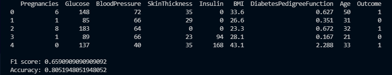

# diabetes-predictor
> Predicts whether an individual will have diabetes or not.

## Table of Contents
* [General Info](#general-information)
* [Technologies Used](#technologies-used)
* [Screenshots](#screenshots)
* [Setup](#setup)
* [Usage](#usage)
* [Project Status](#project-status)
* [Acknowledgements](#acknowledgements)
* [Contact](#contact)

## General Information
- Provide general information about your project here.
- What problem does it (intend to) solve?
- What is the purpose of your project?
- Why did you undertake it?

## Technologies Used
- Python 3
- sklearn
- numpy
- pandas

## Screenshots

## Setup
What are the project requirements/dependencies? Where are they listed? A requirements.txt or a Pipfile.lock file perhaps? Where is it located?

Proceed to describe how to install / setup one's local environment / get started with the project.

## Usage
How does one go about using it?
Provide various use cases and code examples here.

`write-your-code-here`

## Project Status
Project is: _complete_.

## Acknowledgements
- This project was based on [this tutorial](https://www.youtube.com/watch?v=4HKqjENq9OU&list=WL&index=45).

## Contact
Created by [@KiranSmelser](https://github.com/KiranSmelser) - feel free to reach out and contact me!